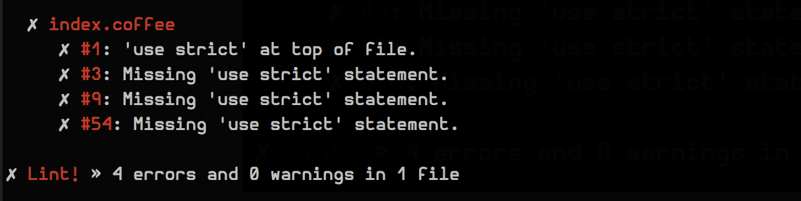

# coffeelint-use-strict [![NPM version][npm-image]][npm-url]
[![Build Status][travis-image]][travis-url] [![Coverage Status][coveralls-image]][coveralls-url] [![Dependency Status][depstat-image]][depstat-url] [![devDependency Status][devdepstat-image]][devdepstat-url]

> [CoffeeLint][coffeelint] rule that enforces usage of [strict mode][moz-strictmode-doc].



## Usage

First, install `coffeelint-use-strict` globally:

```shell
npm install -g coffeelint-use-strict
```

Then, add a `"use_strict"` key with value `{"module": "coffeelint-use-strict"}` to your `coffeelint.json`, e.g.

```json
{
    "use_strict": {
        "module": "coffeelint-use-strict",
        "level": "error",
        "allowGlobal": false,
        "requireGlobal": false
    }
}
```

The `coffeelint` cli will then load this rule automatically. See the [documentation][coffeelint-api-doc] for other ways to make use of custom rules.

## Options

### level
Type: `String`
Default: `'error'`

The severity level of the violated rule. `level` must be one of `'ignore'`, `'warn'`, or `'error'`.

### allowGlobal
Type: `Boolean`
Default: `true`

Allow the `'use strict'` statement to be at the top of a file.

### requireGlobal
Type: `Boolean`
Default: `false`

Require the `'use strict'` statement to be at the top of a file.

## Contributing
In lieu of a formal styleguide, take care to maintain the existing coding style. Add unit tests for any new or changed functionality. Lint and test your code using [gulp][gulp] and [npm-test](https://npmjs.org/doc/test.html). Plus, make sure to adhere to these [commit message conventions](https://docs.google.com/document/d/1QrDFcIiPjSLDn3EL15IJygNPiHORgU1_OOAqWjiDU5Y/edit#heading=h.uyo6cb12dt6w).

## Development
If you wanna use `gulp` and the tasks in `gulpfile.coffee`, please run `npm i gulp` manually. `gulp` is not included as a devDependency, since it cannot be installed on `node v0.8` and we want to be able to install and test this package on TravisCI on `node v0.8`.

## License

[MIT License](http://en.wikipedia.org/wiki/MIT_License) © [Jan Raasch](http://janraasch.com)

[gulp]: http://gulpjs.com/

[coffeelint]: http://www.coffeelint.org
[coffeelint-api-doc]: http://www.coffeelint.org/#api
[moz-strictmode-doc]: https://developer.mozilla.org/en-US/docs/Web/JavaScript/Reference/Functions_and_function_scope/Strict_mode?redirectlocale=en-US&redirectslug=JavaScript%2FReference%2FFunctions_and_function_scope%2FStrict_mode

[npm-url]: https://npmjs.org/package/coffeelint-use-strict
[npm-image]: http://img.shields.io/npm/v/coffeelint-use-strict.svg

[travis-url]: http://travis-ci.org/janraasch/coffeelint-use-strict
[travis-image]: https://secure.travis-ci.org/janraasch/coffeelint-use-strict.svg?branch=master

[coveralls-url]: https://coveralls.io/r/janraasch/coffeelint-use-strict
[coveralls-image]: https://coveralls.io/repos/janraasch/coffeelint-use-strict/badge.svg

[depstat-url]: https://david-dm.org/janraasch/coffeelint-use-strict
[depstat-image]: https://david-dm.org/janraasch/coffeelint-use-strict.svg

[devdepstat-url]: https://david-dm.org/janraasch/coffeelint-use-strict#info=devDependencies
[devdepstat-image]: https://david-dm.org/janraasch/coffeelint-use-strict/dev-status.svg
